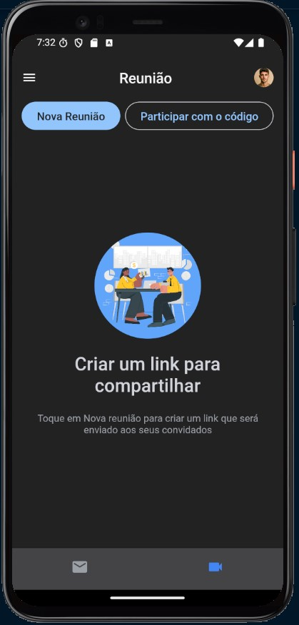

# Gmail Clone 📧

This is a **visual project** built with **React Native**, replicating the Gmail interface. The goal of this project is to provide a user interface similar to Gmail, without backend functionality or actual email operations.

## 📋 Table of Contents

- [About the Project](#about-the-project)
- [Technologies Used](#technologies-used)
- [Installation](#installation)
- [Project](#project)

## About the Project

The **Gmail Clone** is a visual prototype that simulates the interface of an email client, like Gmail. The project focuses on appearance and layout, displaying a list of emails with icons, user avatars, message titles, previews, etc.

## Technologies Used

The project was developed using the following technologies:

- **React Native**: Framework for building mobile apps using React.
- **Typescript**: Programming language used for app development.
- **Expo**: Toolchain to ease development and testing of React Native apps.
- **Tailwind**: For component styling.

## Installation

Follow the steps below to run the project locally:

1. **Clone the repository**:

   ```bash
   git clone https://github.com/jvittor1/Gmail-Clone
   ```

2. **Install dependencies**:

   ```bash
   cd gmail-clone
   npm install
   ```

3. **Run Application**:
   ```bash
   npm start
   ```

## Project

### Here’s how the app looks:

<p align="center">
  
  
  
  
 
</p>
